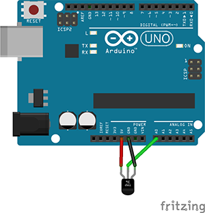

# Domo

Domo is the new thing.

## Setup

### Arduino

Follow the instructions [here](https://github.com/rwaldron/johnny-five#setup-and-assemble-arduino) to get your arduino ready.

Connect the tmp36 sensor to the arduino the following way:


[docs/breadboard/domo.fzz](docs/breadboard/domo.fzz)

### Server

Install [nodejs](http://nodejs.org)

Install [redis](http://redis.io)

Install node dependencies

```cli
  sudo npm install -g grunt-cli
```

```cli
  npm install
```

Build

```cli
  grunt
```

## Run

Launch

```cli
  node domo.js
```

Or, if you install forever `sudo npm install -g forever` and edit the `start.sh` file to match your settings :

```cli
  ./start.sh
```
